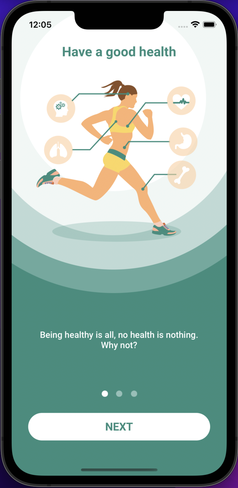
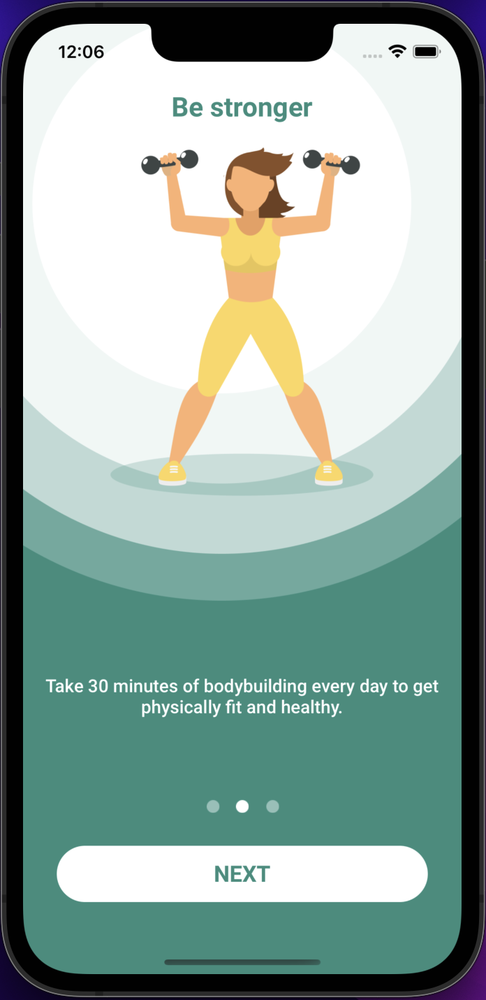
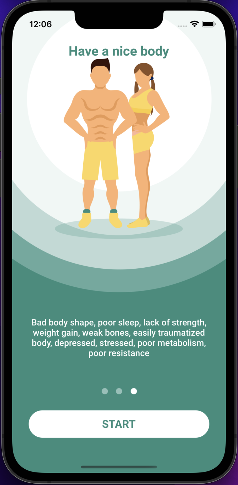
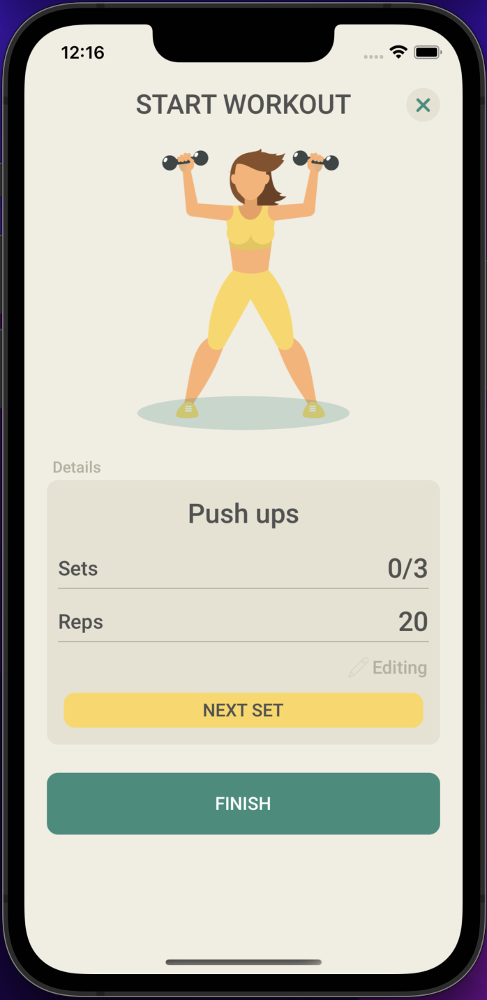

# BeStrong
___
## Оглавление
- **[Описание](#Description)**
- **[Презентация](#Presentation)**
- **[В планах](#NextSteps)**

## Описание
Приложение для планирования тренеровок. Главная цель разработки данного приложения - поработать с "основными" элементами  UIKit.

- Проект написан на **UIKit**
- Архитектура **MVC**
- Верстка интерфейса **Кодом**

Поработал с:
1. Date + DateFormdtter
2. UITableView
3. UIScrollView + FlowLayout
4. StackView
5. Realm, UserDefaults
6. URLSession
7. JSONDecoder
8. UITabBarController
9. UNUserNotificationCenter
10. NotificationCenter
11. CustomAllert
12. CABasicAnimation + UIBezierPath
13. UIImagePickerController
14. Onboarding
15. NSLayoutConstraint
16. Timer
17. UITGestureRecognizer
___

## Презентация
### Онбординг

### Главный экран

### Экран упражнения

### Экран добавления упражнения

### Экран редактирования упражнения (custom alert)

### Экран статистики

### Profile screen

### Работа приложения

___

##  В планах

1. Добавить геолокацию
2. Добавить иконки для упражнений
___

